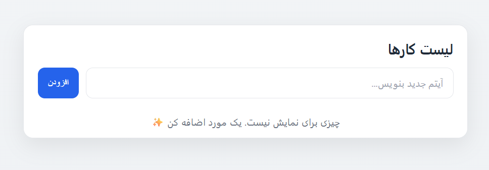
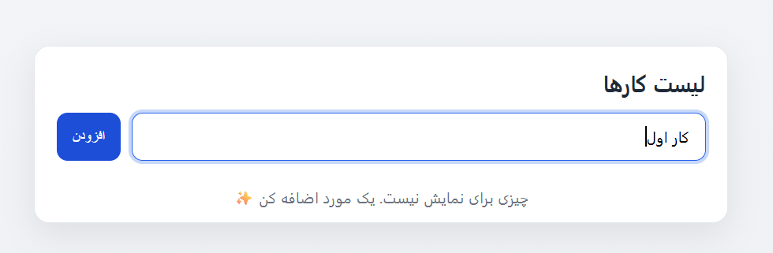
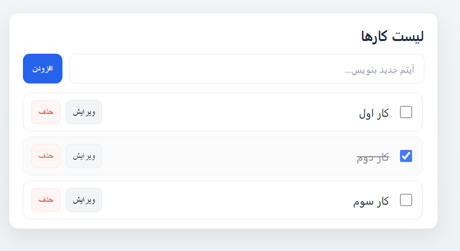
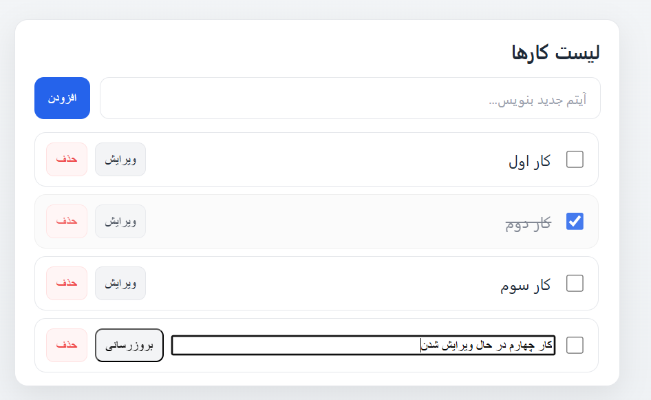

# ToDo-JS
A clean, vanilla-JS Todo app (RTL, Persian UI) with event delegation, inline editing, checkbox completion, and cookie-based persistence. No frameworks. Just HTML/CSS/JS. Accessible controls, responsive design, and a small utility for setCookie/getCookie.

# ex06-JS – Vanilla JS Todo (RTL + Cookies)

A clean, vanilla-JavaScript Todo app (Persian UI, RTL) that demonstrates:

- **Event Delegation** on the `<ul>` list
- **AppendChild** based item creation
- **Inline editing** (Edit → Update)
- **Completion** via checkbox + visual state
- **Persistence with Cookies** (`setCookie` / `getCookie`)
- **Responsive, accessible UI** (keyboard friendly, focus rings)

> No frameworks. Just HTML/CSS/JS.

---

## Preview

| Empty State | Focused Input | Filled List | Editing State |
|---|---|---|---|
|  |  |  |  |

---

## Features

- **Add / Edit / Update / Delete** todos
- **Mark as completed** (checkbox) with subtle UI state
- **Single event listener** on the list (delegation) → future items work automatically
- **Cookie persistence** (30-day expiry, `SameSite=Lax`, path `/`)
- **RTL layout** and Persian labels
- **Responsive card UI**, soft shadows, keyboard focus, accessible labels

---

## Tech Stack

- **HTML5** (`dir="rtl"`)
- **CSS3** (custom properties, responsive layout)
- **Vanilla JS** (modules not required)
- **Cookies** for storage

---

## Getting Started

1. Clone / download the repo.
2. Open `ex06-JS.html` directly in a browser  
   – or run with a simple static server (e.g. VS Code **Live Server**).
3. Type a task and hit **Enter** or click **افزودن**.

> Everything is client-side. No build step needed.

---

## Project Structure

        ├─ ex06-JS.html # App page (RTL)
        ├─ ex06-JS.js # Logic: delegation, editing, cookies
        ├─ styles.css # UI styles
        ├─ img/
            ├─ 01.png # screenshots used in README
            ├─ 02.png
            ├─ 03.png
            └─ 04.png